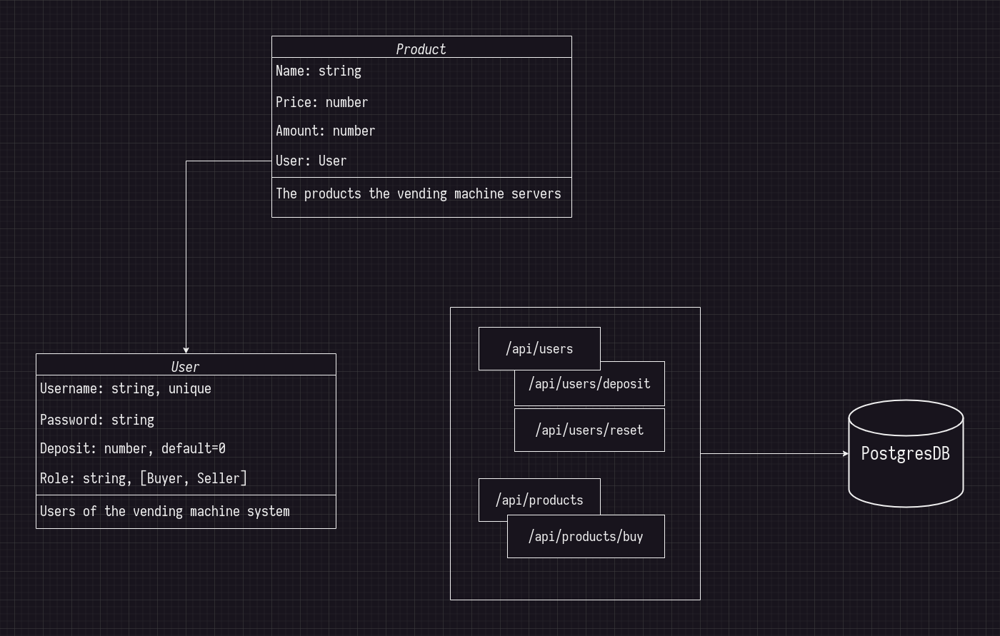

# Vending Machine API
A simple API design with implementations for a vending machine, allowing users (sellers and buyers) to:
- Sellers: Add, Update and Remove products
- Buyers: Deposit coins and Purchase products

## Requirements
- REST API should be implemented as JSON API
- Product model should have `amountAvailable`, `cost`, `productName` and `sellerId` fields
- User model should have `username`, `password`, `deposit` and `role` fields
- User should have CRUD operations (POST shouldn’t require authentication)
- Users can GET products (view products), while modifications (POST, PUT, and DELETE) can be performed only by the seller who created the product
- Users (buyers) should have a `vending machine account` where they can deposit `5, 10, 20, 50 and 100` cent coins into thier accounts. (via `/deposit`)
- Users (buyers) can buy products by specifing the `productId` and `amount` (via `/buy`) 
    - The `/buy` endpoint should return total they’ve spent, products they’ve purchased and their change if there’s any (in 5, 10, 20, 50 and 100 cent coins)
- Users (buyers) can reset their deposit (what does that even mean ?)

## Design
Here is a very simple design to the project, with very minmal set of features (MVP)

Notes: The design is very abstract and doesn't show the details like: `AddProduct`, .. etc but it's obvious as it's CRUD!

## Installation
The project is written in go, even though you don't need to have go installed.

Running on development:
- `docker-compose -f docker-compose.dev.yml up -d --build && docker-compose -f docker-compose.dev.yml logs -f`

Running on Production:
- `docker-compose.prod.yml : docker-compose -f docker-compose.prod.yml --env-file .prod.env up -d --build`

## Documentations

## Q/A

1. Q: Why should the users have `deposit` field when deposit is only made by `buyers` ?

    A: I don't know the full requirements but I think there are 2 cases here, 
    - The deposit is the total money in their account they can withdraw later (and that's not realistic)
    - Sellers can also buy from the vending machine using their accounts! (that's more convencing to me)

2. Q: What does `/reset` do ? Why should the buyers reset their deposit ?

    A: Maybe resetting the deposit means withdrawing money, but this doesn't suit the vending machine. For now I will simply reset the deposit of the user for testing purposes only!

## TODO

- [ ] Kick start: setup server, docker and database.
